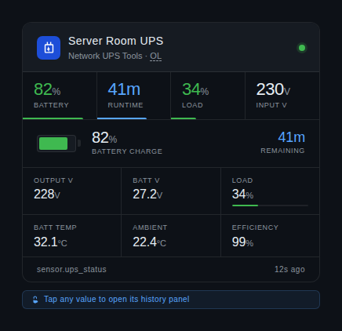

# nut-ups-card

A compact Home Assistant Lovelace card for monitoring UPS systems using the Network UPS Tools (NUT) integration. Designed to match the consistent visual style used across the `ha-cards` collection.



---

## Dependency

This card requires the Home Assistant NUT integration:

- https://www.home-assistant.io/integrations/nut/

[](https://my.home-assistant.io/redirect/integration/?domain=nut)

Ensure the integration is configured and working before adding the card.

---

## Installation

1. Copy `nut-ups-card.js` into your `config/www/` directory.
2. In Home Assistant go to **Settings → Dashboards → Resources** and add:

```text
URL:  /local/nut-ups-card.js
Type: JavaScript module
```

3. Hard-refresh your browser.

---

## Usage

Minimum configuration:

```yaml
type: custom:nut-ups-card
name: UPS
battery_charge_entity: sensor.ups_battery_charge
status_entity: sensor.ups_status
```

Example configuration:

```yaml
type: custom:nut-ups-card
name: Server Room UPS

status_entity: sensor.cyberpower_status
battery_charge_entity: sensor.cyberpower_battery_charge
runtime_entity: sensor.cyberpower_battery_runtime
load_entity: sensor.cyberpower_load
input_voltage_entity: sensor.cyberpower_input_voltage
output_voltage_entity: sensor.cyberpower_output_voltage
battery_voltage_entity: sensor.cyberpower_battery_voltage
battery_temperature_entity: sensor.cyberpower_battery_temperature
ambient_temperature_entity: sensor.server_room_temperature
```

---

## Features

- Status indicator with online / battery / alarm state colouring
- Animated status ring glow
- Battery charge bar with dynamic colouring
- Compact metrics grid
- Tap-to-history support for all values
- Theme-aware styling for dark and light dashboards

---

## Configuration reference

| Key | Type | Description |
|-----|------|-------------|
| `type` | string | Must be `custom:nut-ups-card` |
| `name` | string | Card title |
| `status_entity` | string | UPS status sensor |
| `battery_charge_entity` | string | Battery percentage sensor |
| `runtime_entity` | string | Runtime remaining sensor |
| `load_entity` | string | UPS load sensor |
| `input_voltage_entity` | string | Input voltage sensor |
| `output_voltage_entity` | string | Output voltage sensor |
| `battery_voltage_entity` | string | Battery voltage sensor |
| `battery_temperature_entity` | string | Battery temperature sensor |
| `ambient_temperature_entity` | string | Ambient temperature sensor |

---

## Notes

- All entities should expose numeric states where applicable.
- The card automatically adapts to Home Assistant themes using CSS variables.
- Any unavailable entities are gracefully hidden from the layout.
