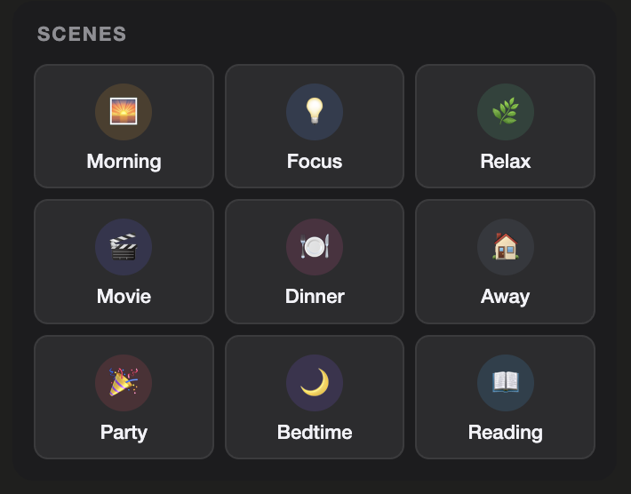

# scene-grid-card

A dense, touch-friendly scene launcher card for Home Assistant Lovelace dashboards. Designed for fast scene access with configurable colours, compact spacing, and consistent styling across the `ha-cards` collection.



---

## Installation

1. Copy `scene-grid-card.js` into your `config/www/` directory.
2. In Home Assistant go to **Settings → Dashboards → Resources** and add:

```text
URL:  /local/scene-grid-card.js
Type: JavaScript module
```

3. Hard-refresh your browser.

---

## Usage

Minimum configuration:

```yaml
type: custom:scene-grid-card
scenes:
  - scene.movie_time
  - scene.relax
```

Example configuration:

```yaml
type: custom:scene-grid-card
title: Living Room Scenes
columns: 3

scenes:
  - entity: scene.movie_time
    color: "#ff9800"

  - entity: scene.gaming
    color: "#2196f3"

  - entity: scene.relax
    color: "#9c27b0"

  - entity: scene.all_off
    color: "#f44336"
```

---

## Features

- Compact multi-column scene grid
- Per-scene accent colours
- Activation flash animation
- Debounced taps to prevent accidental double execution
- Optional header
- Automatic scene naming from Home Assistant entities

---

## Configuration reference

| Key | Type | Default | Description |
|-----|------|---------|-------------|
| `type` | string | — | Must be `custom:scene-grid-card` |
| `title` | string | none | Optional card title |
| `columns` | number | `3` | Number of scene columns |
| `scenes` | list | — | List of scenes to display |

### Scene object

| Key | Type | Description |
|-----|------|-------------|
| `entity` | string | Scene entity ID |
| `color` | string | Optional accent colour |
| `name` | string | Override displayed name |
| `icon` | string | Override displayed icon |

---

## Notes

- Scene activation uses the standard Home Assistant `scene.turn_on` service.
- The card is YAML configured and does not require a visual editor.
- Theme colours automatically adapt to dark and light dashboards.
